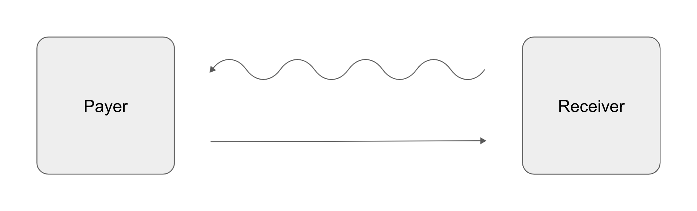

# Payers

Payers pay an agreed upon fixed yield in exchange for an actually realized
floating yield covered by the Receiver. The Payer is "long yield". This means
that if the floating yield exceeds the fixed yield they have to pay, then the
Payer makes a profit. If on the other hand the realized floating yield is below
the fixed yield at the end of the tenor, then the Receiver makes a profit, which
implies a net loss for the Payer. A payer swap is therefore a bet on higher
floating yields over a given tenor. Payers can speculate on overperforming
market conditions compared to the guaranteed fixed interest rate of an asset.

## Making a Profit

Payers can make a profit under the following constraints and conditions.

- The yield swap is a futures contract over a given tenor, e.g. 10 days.
- The Payer pays the agreed upon fixed yield.
- The Payer receives the floating yield actually realized after the tenor.
- The fixed yield is **smaller** than the floating yield.

## Incurring a Loss

Payers can incur a loss under the following constraints and conditions.

- The yield swap is a futures contract over a given tenor, e.g. 10 days.
- The Payer pays the agreed upon fixed yield.
- The Payer receives the floating yield actually realized after the tenor.
- The fixed yield is **greater** than the floating yield.

