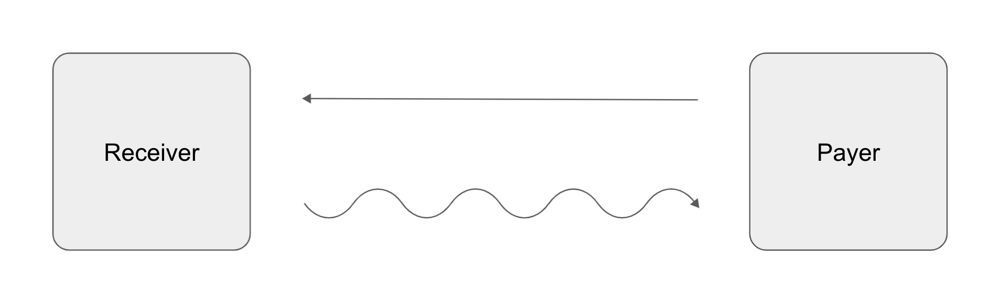
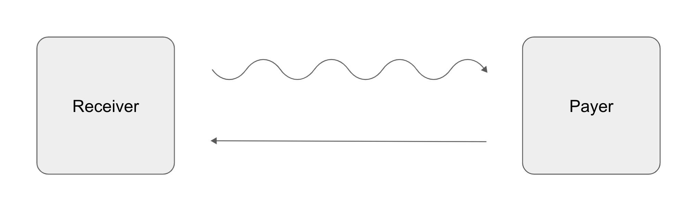

# Receivers

Receivers pay the actually realized floating yield in exchange for an agreed
upon fixed yield covered by the Payer. The Receiver is "short yield". This means
that if the fixed yield exceeds the floating yield they have to pay, then the
Receiver makes a profit. If on the other hand the agreed upon fixed yield is
below the realized floating yield at the end of the tenor, then the Payer makes
a profit, which implies a net loss for the Receiver. A receiver swap is
therefore a bet on higher fixed yields over a given tenor. Receivers can
speculate on underperforming market conditions compared to the guaranteed fixed
interest rate of an asset.

## Making a Profit

Receivers can make a profit under the following constraints and conditions.

- The yield swap is a futures contract over a given tenor, e.g. 10 days.
- The Receiver pays the actually realized floating yield.
- The Receiver receives the fixed yield agreed upon before the swap.
- The floating yield is **smaller** than the fixed yield.

## Incurring a Loss

Receivers can incur a loss under the following constraints and conditions.

- The yield swap is a futures contract over a given tenor, e.g. 10 days.
- The Receiver pays the actually realized floating yield.
- The Receiver receives the fixed yield agreed upon before the swap.
- The floating yield is **greater** than the fixed yield.

